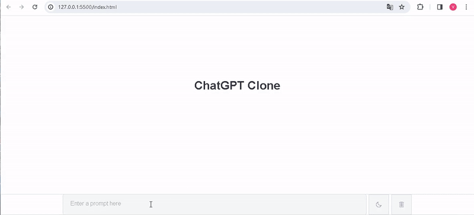

<h1>ChatGPT-Clone-Website </h1>

I've independently designed and coded a responsive ChatGPT-Clone-Website, and it's ready to explore!

🔸 Project Name: ChatGPT-Clone-Website

🔸 Technologies Used: HTML, CSS, JavaScript

🔸 Project Description: This website, which I designed and coded from scratch, works flawlessly on various devices, from mobile phones to desktop computers...

<h2>Screen_Shoot</h2>

